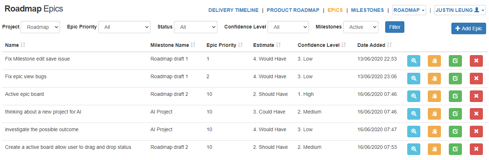

# Roadmap

The roadmap is a simple tracking tool built by PHP. For the periphery of the roadmap, these are represented as Features, Epics, and Milestones.
A milestone is a marker of a stage in a project. Epic is the outline of the feature that highlight the task. 

# Installation
These instructions will get you a copy of the project up and running on your local machine for development and testing purposes. See deployment for notes on how to deploy the project on a live system.

1. Copy file to your server or your local machine
2. Install roadmap SQL to your database server

When the project is runing you can use this test account for your first login

`Test account`
* email: test@test.com
* password: T123456

## Built With

* [Mini](https://github.com/panique/mini) - The PHP Web Framework used
* [Wysihtml5](https://github.com/xing/wysihtml5/) - Adding HTML markup on textarea

