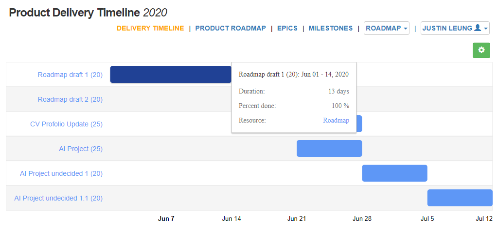

# Roadmap

Roadmap is an simple and easy to use roadmap planning tools. Roadmap is a plan for me to plan my work over weeks and months.
Its really useful for me to set a goal and view the acheivement that I have got.

# Installation
These instructions will get you a copy of the project up and running on your local machine for development and testing purposes. See deployment for notes on how to deploy the project on a live system.

1. Copy file to your server or your local machine
2. Install roadmap SQL to your database server

When the project is runing you can use this test account for your first login

`Test account`
* email: test@test.com
* password: T123456

## Built With

* [Mini](https://github.com/panique/mini) - The web framework used
* [Wysihtml5](https://github.com/xing/wysihtml5/) - Adding style on textarea

